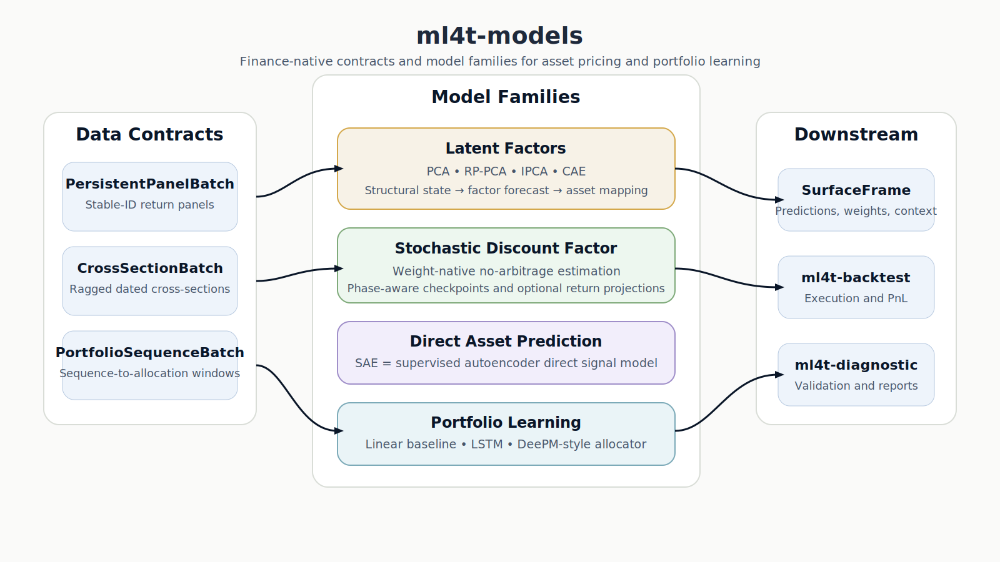

# ml4t-models

[](https://www.python.org/downloads/)
[](https://pypi.org/project/ml4t-models/)
[](https://opensource.org/licenses/MIT)

Finance-native model implementations for latent-factor estimation, stochastic discount factor learning, direct asset prediction, and end-to-end portfolio learning.

Documentation: https://ml4trading.io/docs/models/

## Part of the ML4T Library Ecosystem

This library is one of the ML4T libraries supporting the research and production workflow in *Machine Learning for Trading*.


## What This Library Does

`ml4t-models` packages paper-faithful model families that are common in modern empirical asset pricing and portfolio learning:

- Latent-factor estimators with explicit structural outputs:
  - `PCAModel`
  - `RPPCAModel`
  - `IPCAModel`
  - `CAEModel`
- Weight-native stochastic discount factor modeling:
  - `StochasticDiscountFactorModel`
- Direct asset prediction:
  - `SAEModel` (`SAE` = supervised autoencoder)
- End-to-end portfolio learning:
  - `LinearFeaturePortfolioModel`
  - `LSTMPortfolioModel`
  - `DeepPortfolioModel`

The library is built around finance-native contracts rather than generic tensor trainers:

- `PersistentPanelBatch` for stable-ID panels
- `CrossSectionBatch` for ragged dated cross-sections
- `PortfolioSequenceBatch` for sequence-to-allocation models

It also keeps the predictive steps explicit:

- structural extraction
- factor-premium forecasting
- asset mapping
- downstream surface generation for `ml4t-backtest` and `ml4t-diagnostic`



## Installation

```bash
pip install ml4t-models
```

Optional extras:

```bash
pip install ml4t-models[deep]         # torch-backed neural models
pip install ml4t-models[integration]  # polars + ml4t-specs bridges
pip install ml4t-models[docs]         # mkdocs site build
pip install ml4t-models[all]
```

## Quick Start

### 1. Latent-Factor Forecast Pipeline

```python
import numpy as np

from ml4t.models import (
    BetaLambdaMapper,
    CrossSectionBatch,
    ExpandingMeanFactorForecaster,
    IPCAConfig,
    IPCAModel,
    LatentFactorForecastPipeline,
)

batch = CrossSectionBatch(
    characteristics=np.random.randn(24, 200, 12),
    returns=np.random.randn(24, 200),
    timestamps=tuple(range(24)),
)

pipeline = LatentFactorForecastPipeline(
    model=IPCAModel(IPCAConfig(n_factors=3)),
    forecaster=ExpandingMeanFactorForecaster(),
    mapper=BetaLambdaMapper(),
)
pipeline.fit(batch)
prediction = pipeline.predict(batch)

print(prediction.asset_forecast.expected_returns.shape)
# (24, 200)
```

### 2. Weight-Native Stochastic Discount Factor

```python
import numpy as np

from ml4t.models import CrossSectionBatch, StochasticDiscountFactorConfig, StochasticDiscountFactorModel

batch = CrossSectionBatch(
    characteristics=np.random.randn(36, 300, 16),
    returns=np.random.randn(36, 300),
    context_features=np.random.randn(36, 8),
    timestamps=tuple(range(36)),
)

model = StochasticDiscountFactorModel(
    StochasticDiscountFactorConfig(checkpoint_epochs=(256, 512, 768, 1024, 1280))
)
model.fit(batch)
state = model.extract(batch, checkpoint=1280)

print(state.asset_weights.shape)
# (36, 300)
```

### 3. End-to-End Portfolio Learning

```python
import numpy as np

from ml4t.models import LSTMPortfolioConfig, LSTMPortfolioModel, PortfolioSequenceBatch

batch = PortfolioSequenceBatch(
    features=np.random.randn(8, 63, 20, 10),
    returns=np.random.randn(8, 63, 20),
    timestamps=tuple(range(63)),
    asset_ids=tuple(f"asset_{i}" for i in range(20)),
)

model = LSTMPortfolioModel(LSTMPortfolioConfig(max_iters=20, checkpoint_every=5))
model.fit(batch)
weights = model.predict(batch, checkpoint=20)

print(weights.weights.shape)
# (8, 63, 20)
```

### 4. Hand Off Predictions To The Rest Of ML4T

```python
from ml4t.models import prediction_surface_from_asset_forecast, write_backtest_surfaces

surface = prediction_surface_from_asset_forecast(prediction.asset_forecast)
write_backtest_surfaces("artifacts/run_001", predictions=surface)
```

## Model Families

### Latent Factors

These models estimate a structural representation first, then let a separate forecaster produce ex ante factor premia.

| Model | Contract | Native output | Predictive step |
|---|---|---|---|
| `PCAModel` | `PersistentPanelBatch` | static loadings, factor returns | factor-premium forecaster + mapper |
| `RPPCAModel` | `PersistentPanelBatch` | risk-premium-aware latent factors | factor-premium forecaster + mapper |
| `IPCAModel` | `CrossSectionBatch` | characteristic-implied betas, factor history | factor-premium forecaster + mapper |
| `CAEModel` | `CrossSectionBatch` | nonlinear characteristic betas, factor history | factor-premium forecaster + mapper |

### Stochastic Discount Factor

`StochasticDiscountFactorModel` is not a `beta × lambda` latent-factor model. It learns a weight-native no-arbitrage object and exposes:

- asset weights
- SDF series
- checkpointed phase-aware training state

Optional return projections are handled by separate mappers.

### Direct Asset Prediction

`SAEModel` is a supervised autoencoder signal model. In this library it is treated as a direct predictor, not a latent-factor model.

### Portfolio Learning

Portfolio models learn allocations directly:

- `LinearFeaturePortfolioModel` as a deterministic baseline
- `LSTMPortfolioModel` as a sequence baseline
- `DeepPortfolioModel` as a structured DeePM-style allocator

## Design Principles

- Finance-native data contracts rather than generic dataloaders
- Explicit structural and predictive stages
- Checkpoint-aware neural training surfaces
- Clear separation between:
  - model estimation
  - forecasting
  - backtest and diagnostic integration
- Integration boundaries with sibling libraries instead of duplicated evaluation logic

## Documentation

- [Getting Started](docs/getting-started/quickstart.md)
- [User Guide](docs/user-guide/index.md)
- [Architecture](docs/reference/architecture.md)
- [API Reference](docs/api/index.md)
- [Book Guide](docs/book-guide/index.md)
