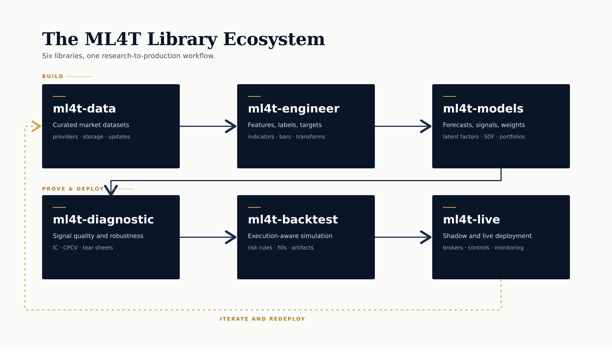
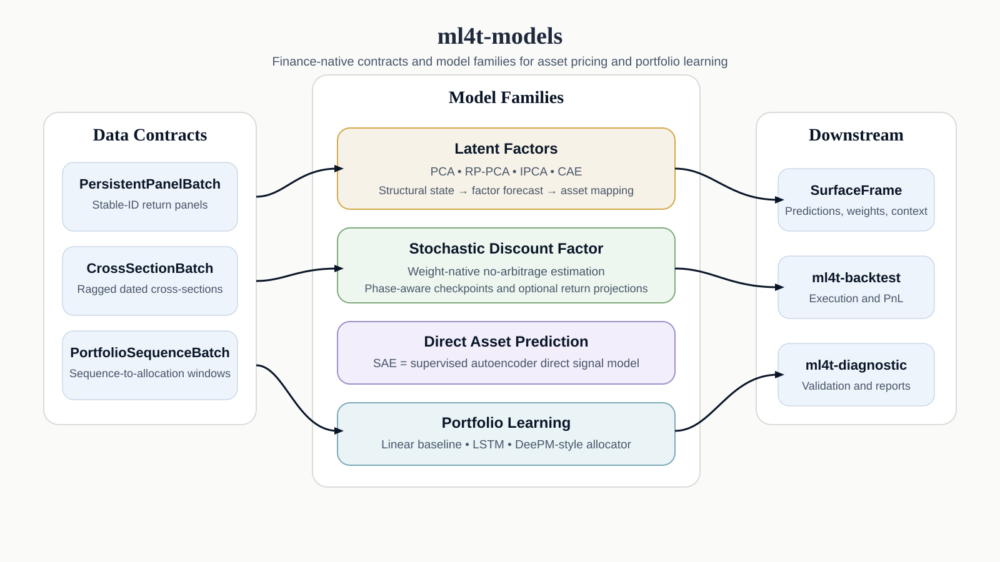

# ml4t-models

[](https://www.python.org/downloads/)
[](https://pypi.org/project/ml4t-models/)
[](https://opensource.org/licenses/MIT)

Finance-specific models for asset pricing, prediction, and portfolio learning.

Documentation: [ml4trading.io/docs/models](https://www.ml4trading.io/docs/models/)

## Part of the ML4T Library Ecosystem

This library is one of seven interconnected ML4T libraries supporting the research and production workflow described in [Machine Learning for Trading](https://ml4trading.io).



## What This Library Does

`ml4t-models` packages paper-faithful model families that are common in modern empirical asset pricing and portfolio learning:

- Latent-factor estimators with explicit structural outputs:
  - `PCAModel`
  - `RPPCAModel`
  - `IPCAModel`
  - `CAEModel`
- Weight-native stochastic discount factor modeling:
  - `StochasticDiscountFactorModel`
- Direct asset prediction:
  - `SAEModel` (`SAE` = supervised autoencoder)
- End-to-end portfolio learning:
  - `LinearFeaturePortfolioModel`
  - `LSTMPortfolioModel`
  - `DeepPortfolioModel`

The library is built around finance-native contracts rather than generic tensor trainers:

- `PersistentPanelBatch` for stable-ID panels
- `CrossSectionBatch` for ragged dated cross-sections
- `PortfolioSequenceBatch` for sequence-to-allocation models

It also keeps the predictive steps explicit:

- structural extraction
- factor-premium forecasting
- asset mapping
- downstream prediction and weight frames for `ml4t-backtest` and `ml4t-diagnostic`



## Installation

```bash
pip install ml4t-models
```

Optional extras:

```bash
pip install ml4t-models[deep]         # torch-backed neural models
pip install ml4t-models[integration]  # polars + ml4t-specs bridges
pip install ml4t-models[all]          # all runtime capabilities
```

Supported stable interpreters are Python 3.12, 3.13, and 3.14. Python 3.15 prereleases run a
separate compatibility gate and are not yet part of the stable support range.

Documentation tools are contributor dependencies. From a source checkout, run
`uv sync --extra docs` before building the site.

## Quick Start

The base package can produce a first forecast on a small synthetic panel without credentials or
an accelerator. Run this complete example with `pip install ml4t-models`:

```python
import numpy as np
from ml4t.models import (
    BetaLambdaMapper,
    ExpandingMeanFactorForecaster,
    LatentFactorForecastPipeline,
    PCAConfig,
    PCAModel,
    PersistentPanelBatch,
)

asset_ids = tuple(f"asset_{i}" for i in range(6))
train = PersistentPanelBatch(
    returns=np.random.default_rng(1).normal(scale=0.02, size=(12, 6)),
    timestamps=tuple(f"2024-{month:02d}" for month in range(1, 13)),
    asset_ids=asset_ids,
)
future = PersistentPanelBatch(timestamps=("2025-01", "2025-02"), asset_ids=asset_ids)
pipeline = LatentFactorForecastPipeline(
    model=PCAModel(PCAConfig(n_factors=2)),
    forecaster=ExpandingMeanFactorForecaster(),
    mapper=BetaLambdaMapper(),
)
pipeline.fit(train)
forecast = pipeline.predict(future).asset_forecast.expected_returns
assert forecast.shape == (2, 6) and np.isfinite(forecast).all()
print(forecast.shape)  # (2, 6)
```

The forecast uses the training factor history and preserves the future dates and asset order.
It does not imply trading performance. The [Quickstart](docs/getting-started/quickstart.md)
explains the result, and the [Book Guide](docs/book-guide/index.md) links to pinned teaching files.
The `deep` extra is needed for neural models; the `integration` extra adds Polars and Specs support.

## Model Families

### Latent Factors

These models estimate a structural representation first, then let a separate forecaster produce ex ante factor premia.

| Model | Contract | Native output | Predictive step |
|---|---|---|---|
| `PCAModel` | `PersistentPanelBatch` | static loadings, factor returns | factor-premium forecaster + mapper |
| `RPPCAModel` | `PersistentPanelBatch` | risk-premium-aware latent factors | factor-premium forecaster + mapper |
| `IPCAModel` | `CrossSectionBatch` | characteristic-implied betas, factor history | factor-premium forecaster + mapper |
| `CAEModel` | `CrossSectionBatch` | nonlinear characteristic betas, factor history | factor-premium forecaster + mapper |

### Stochastic Discount Factor

`StochasticDiscountFactorModel` is not a `beta × lambda` latent-factor model. It learns a weight-native no-arbitrage object and exposes:

- asset weights
- SDF series
- checkpointed phase-aware training state

Optional return projections are handled by separate mappers.

### Direct Asset Prediction

`SAEModel` is a supervised autoencoder signal model. In this library it is treated as a direct predictor, not a latent-factor model.

### Portfolio Learning

Portfolio models learn allocations directly:

- `LinearFeaturePortfolioModel` as a deterministic baseline
- `LSTMPortfolioModel` as a sequence baseline
- `DeepPortfolioModel` as a structured DeePM-style allocator

## Design Principles

- Finance-native data contracts rather than generic dataloaders
- Explicit structural and predictive stages
- Checkpoint-aware neural training
- Clear separation between:
  - model estimation
  - forecasting
  - backtest and diagnostic integration
- Integration boundaries with sibling libraries instead of duplicated evaluation logic

## Documentation

- [Getting Started](docs/getting-started/quickstart.md)
- [User Guide](docs/user-guide/index.md)
- [Architecture](docs/reference/architecture.md)
- [API Reference](docs/api/index.md)
- [Book Guide](docs/book-guide/index.md)

## Development

Install the locked development environment, then run the repository gates before opening a pull
request:

```bash
uv sync --locked --dev --extra docs
uv run ruff check src/ tests/ examples/ scripts/
uv run ruff format --check src/ tests/ examples/ scripts/
uv run ty check
uv run pytest tests/ -q --cov-report=json:coverage.json
uv run python scripts/ci/check_coverage.py coverage.json
uv run mkdocs build --strict
uv build
```

## Project Links

- [Documentation](https://www.ml4trading.io/docs/models/)
- [Issues](https://github.com/ml4t/models/issues)
- [Releases](https://github.com/ml4t/models/releases)
- [License](LICENSE)
