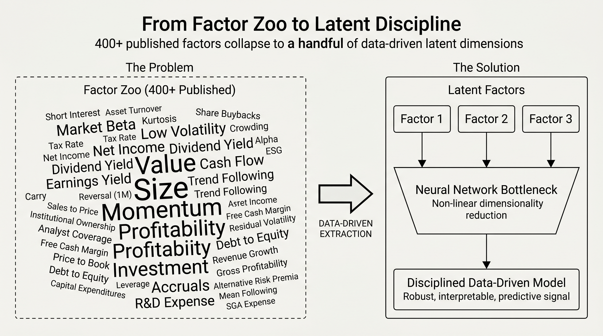

# Book Guide

`ml4t-models` is the library form of the model families developed manually in the book notebooks.



The goal is not to hide the teaching implementation. The goal is to:

- show the architecture and mathematics clearly in the chapter notebooks
- use the library for repeatable case-study execution and downstream integration

## Chapter Mapping

### Chapter 14: Latent Factors

The latent-factor chapter corresponds most directly to:

- `PCAModel`
- `RPPCAModel`
- `IPCAModel`
- `CAEModel`
- `StochasticDiscountFactorModel`
- `SAEModel` as supervised autoencoder direct prediction

The key conceptual transition from the notebooks to the library is:

- notebook exposition may derive the math and architecture step by step
- library code enforces the clean separation between:
  - structural extraction
  - factor forecasting
  - asset mapping

That separation matters most for `IPCAModel` and `CAEModel`. In the teaching notebooks, it
is helpful to show the full architecture and fitted-return logic step by step. In the
library, the corresponding production object is the two-step pipeline:

```text
structural estimator -> factor-premium forecaster -> asset mapper
```

### Chapter 17: Portfolio Construction

The end-to-end allocation family corresponds to:

- `LinearFeaturePortfolioModel`
- `LSTMPortfolioModel`
- `DeepPortfolioModel`

These models are designed to connect naturally to:

- Chapter 18 cost modeling
- Chapter 19 risk controls
- Chapter 20 strategy analysis

## Why The Library Split Matters

The book often needs to compare multiple modeling ideas side by side:

- latent-factor models
- no-arbitrage SDF models
- direct signal models
- end-to-end allocation models

The library turns those into explicit families instead of treating them as one generic “deep learning model.”

## Case Studies

The case studies are intended to act as:

- integration tests
- realistic pressure tests for the API
- examples of how to hand model outputs into `ml4t-backtest` and `ml4t-diagnostic`

They should not define the public API by accident.

## Compatibility Status

The `0.1.0b0` beta line is validated against the Chapter 14 teaching flow and the shared
case-study latent-factor bridge.

| Book surface | Validation status |
|---|---|
| `14_latent_factors/04_ipca.ipynb` | full notebook execution passed |
| `14_latent_factors/05_rp_pca.ipynb` | full notebook execution passed |
| `14_latent_factors/06_conditional_autoencoder.ipynb` | full notebook execution passed |
| `14_latent_factors/07_stochastic_discount_factor.ipynb` | full notebook execution passed |
| `14_latent_factors/08_supervised_autoencoder.ipynb` | Papermill smoke execution passed; full production training is long-running |
| `14_latent_factors/09_case_study_insights.ipynb` | full notebook execution passed |
| `case_studies.utils.latent_factors.library_bridge` | synthetic PCA, IPCA, CAE, SAE, and SDF bridge smoke checks passed |

The teaching notebooks keep hand-built implementations where that improves exposition. The
case-study path uses `ml4t-models` through the shared latent-factor bridge so the same
contracts are exercised in walk-forward validation and registry-backed analysis.

## Case-Study Validation

The beta gate also checks that each case-study family can execute its model-specific
latent-factor notebooks through the shared bridge.

| Case study | Validation status |
|---|---|
| ETF returns | PCA, IPCA, SDF, and SAE cached executions passed; CAE passed in cached three-fold validation mode |
| US firm characteristics | IPCA, CAE, SDF, and SAE passed in cached three-fold validation mode |
| S&P 500 option analytics | PCA, IPCA, CAE, SDF, and SAE passed in cached three-fold validation mode |

The ETF CAE notebook also reached the cached full-fold execution path and loaded the
registry-backed model outputs before the notebook kernel exited while processing the large
cached result set. The three-fold validation run exercises the same library bridge,
checkpoint handling, prediction schema, and registry persistence path with a bounded
runtime footprint.

## Evaluation Boundary

Case-study IC reporting is delegated to `ml4t-diagnostic`:

- fold-level scoring calls `ml4t.diagnostic.metrics.cross_sectional_ic`
- pooled model-analysis summaries call `cross_sectional_ic` and `cross_sectional_ic_series`
- model outputs are converted into `PredictionsFrame`, `SignalsFrame`, `WeightsFrame`, and
  `ml4t-backtest` handoff payloads by library adapters

`ml4t-models` remains responsible for fitting and output contracts. Statistical diagnostics
and execution simulation remain owned by `ml4t-diagnostic` and `ml4t-backtest`.

## Recommended Reading Order

If you are moving from the book notebooks to the library:

1. [Data Contracts](../user-guide/data-contracts.md)
2. [Latent-Factor Pipelines](../user-guide/latent-factor-pipelines.md)
3. [Stochastic Discount Factor](../user-guide/stochastic-discount-factor.md)
4. [Portfolio Learning](../user-guide/portfolio-learning.md)
5. [Integration](../user-guide/integration.md)
