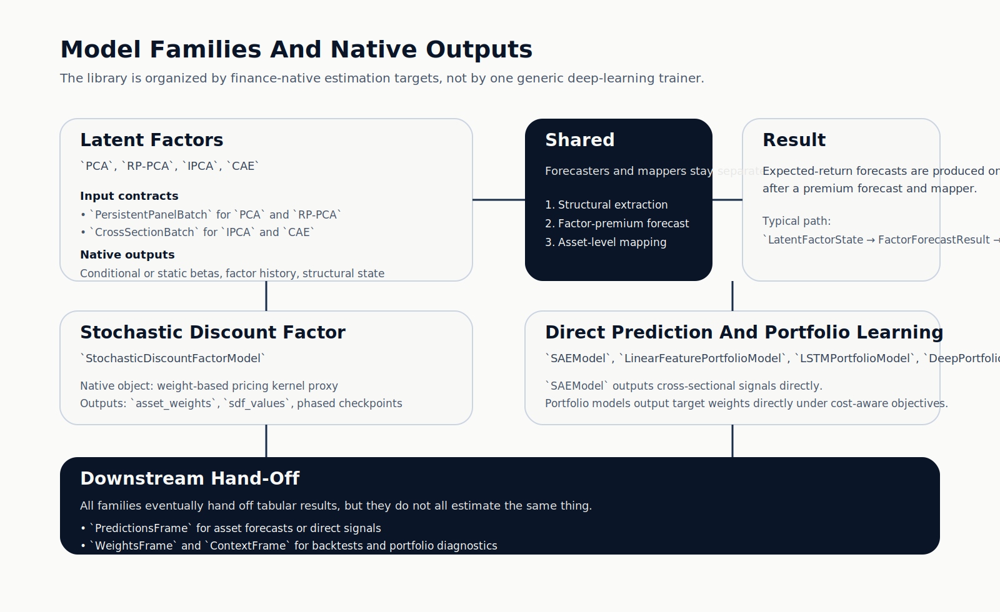

# ML4T Models

Build finance-native latent-factor, stochastic discount factor, direct signal, and portfolio-learning models without collapsing everything into one generic trainer.

`ml4t.models` is the modeling layer in the ML4T stack. It packages model families that matter in empirical asset pricing and portfolio construction while keeping the contracts explicit:

- what kind of data each model expects
- what object it estimates
- what must still happen before you have an implementable forecast or tradable weight vector

If you are new to the library, start with the [Quickstart](getting-started/quickstart.md). If you are coming from *Machine Learning for Trading*, the [Book Guide](book-guide/index.md) maps the chapter implementations to the production API.

<div class="grid cards" markdown>

-   :material-finance:{ .lg .middle } __Latent Factors Done Explicitly__

    ---

    Structural extraction, factor-premium forecasting, and asset mapping are separate stages.
    This keeps PCA, RP-PCA, IPCA, and CAE conceptually clean.
    [:octicons-arrow-right-24: Latent-Factor Pipelines](user-guide/latent-factor-pipelines.md)

-   :material-scale-balance:{ .lg .middle } __No-Arbitrage SDF Modeling__

    ---

    The stochastic discount factor family is weight-native and phase-aware.
    It is not forced into the same `beta × lambda` contract as latent-factor models.
    [:octicons-arrow-right-24: Stochastic Discount Factor](user-guide/stochastic-discount-factor.md)

-   :material-chart-line-variant:{ .lg .middle } __End-To-End Portfolio Learning__

    ---

    Learn allocations directly with deterministic, LSTM, and DeePM-style portfolio models.
    Keep allocation objectives separate from return forecasting logic.
    [:octicons-arrow-right-24: Portfolio Learning](user-guide/portfolio-learning.md)

-   :material-connection:{ .lg .middle } __Built For The ML4T Stack__

    ---

    Emit prediction and weight frames for `ml4t-backtest` and `ml4t-diagnostic`
    without duplicating evaluation logic inside the model library.
    [:octicons-arrow-right-24: Integration](user-guide/integration.md)

</div>

## Architecture At A Glance



## Why This Library Exists

Many finance models look similar at the tensor level but behave very differently conceptually:

- `PCA` and `RP-PCA` estimate persistent-panel latent factors
- `IPCA` and `CAE` estimate conditional exposures from dated cross-sections
- `StochasticDiscountFactorModel` learns a no-arbitrage pricing object through weight-native training
- `SAEModel` is a direct supervised predictor
- portfolio models learn allocations directly rather than first forecasting returns

The library reflects those differences instead of hiding them behind one catch-all `fit/predict` story.

## Quick Example

```python
import numpy as np

from ml4t.models import (
    BetaLambdaMapper,
    CrossSectionBatch,
    ExpandingMeanFactorForecaster,
    IPCAConfig,
    IPCAModel,
    LatentFactorForecastPipeline,
)

batch = CrossSectionBatch(
    characteristics=np.random.randn(24, 150, 10),
    returns=np.random.randn(24, 150),
    timestamps=tuple(range(24)),
)

pipeline = LatentFactorForecastPipeline(
    model=IPCAModel(IPCAConfig(n_factors=3)),
    forecaster=ExpandingMeanFactorForecaster(),
    mapper=BetaLambdaMapper(),
)
pipeline.fit(batch)
prediction = pipeline.predict(batch)

print(prediction.state.asset_betas.shape)
print(prediction.asset_forecast.expected_returns.shape)
```

## Three Core Contracts

| Contract | Used by | What it represents |
|---|---|---|
| `PersistentPanelBatch` | `PCAModel`, `RPPCAModel` | stable-entity return panel |
| `CrossSectionBatch` | `IPCAModel`, `CAEModel`, `SAEModel`, `StochasticDiscountFactorModel` | dated observed cross-sections, ragged by construction |
| `PortfolioSequenceBatch` | `LinearFeaturePortfolioModel`, `LSTMPortfolioModel`, `DeepPortfolioModel` | sequence-to-allocation learning |

## Model Families

```text
latent_factors
├── PCAModel
├── RPPCAModel
├── IPCAModel
└── CAEModel

stochastic_discount_factor
└── StochasticDiscountFactorModel

asset_prediction
└── SAEModel

portfolio
├── LinearFeaturePortfolioModel
├── LSTMPortfolioModel
└── DeepPortfolioModel
```

## Where To Start

- [Installation](getting-started/installation.md)
- [Quickstart](getting-started/quickstart.md)
- [Data Contracts](user-guide/data-contracts.md)
- [Training Procedures](user-guide/training-procedures.md)
- [Latent-Factor Models](user-guide/latent-factor-models.md)
- [Architecture](reference/architecture.md)
- [API Reference](api/index.md)
