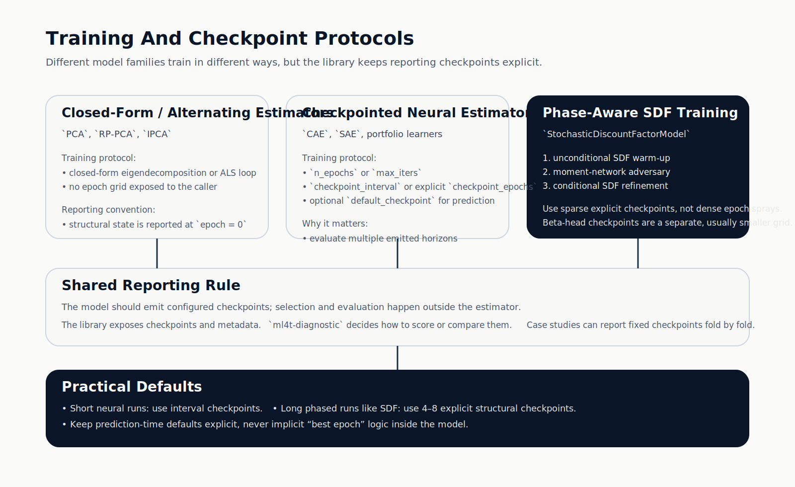
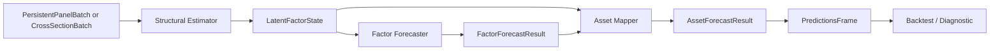
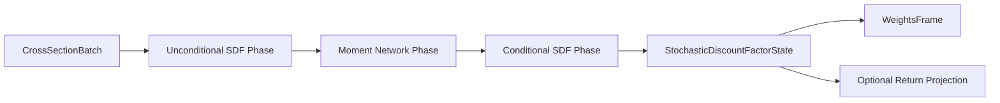

# Architecture

The library is organized around finance-native model families and contracts.

## Top-Level Design


## Why The Families Are Separate

### Latent Factors

These families estimate structural state first:

- loadings or conditional betas
- latent factor realizations
- then expected returns through a separate factor-premium forecast

### Stochastic Discount Factor

This family estimates a weight-native no-arbitrage object:

- asset weights
- SDF series
- optional downstream return projections

### Direct Asset Prediction

This family predicts signals directly:

- no latent factor state
- no separate premium forecast

### Portfolio Learning

This family learns allocations directly:

- sequential input windows
- cost-aware or risk-aware objectives
- target-weight outputs

## Training Protocol Map



## Latent-Factor Pipeline Diagram



## Stochastic Discount Factor Flow



## Portfolio Flow


## Package Layout

```text
ml4t.models
├── api.py
├── types.py
├── pipelines.py
├── configs/
├── latent_factors/
├── forecasters/
├── mappers/
├── stochastic_discount_factor/
├── asset_prediction/
├── portfolio/
└── integration/
```

## Neural backends and devices

`torch`-based models resolve `device` from config via `ml4t.models._internal.torch_runtime.resolve_device`:

- **`cpu`** — default.
- **`cuda`** / **`cuda:N`** — when CUDA is available.
- **`mps`** — when the PyTorch MPS backend is available (typical on Apple Silicon); otherwise CPU.

Unavailable accelerators fall back to CPU so jobs stay runnable in CI or CPU-only environments.

## Boundary Rules

### Belongs Here

- model estimation
- batch and result contracts
- checkpoint handling
- results-frame emission

### Belongs Elsewhere

- feature engineering: `ml4t-engineer`
- execution and order simulation: `ml4t-backtest`
- validation and diagnostics: `ml4t-diagnostic`
