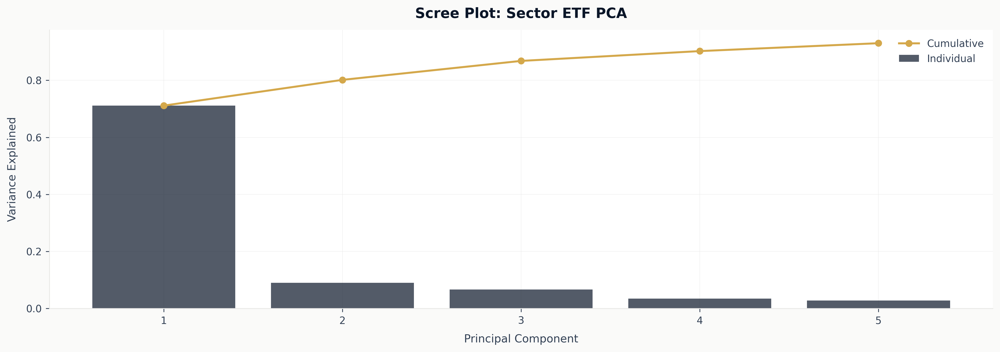
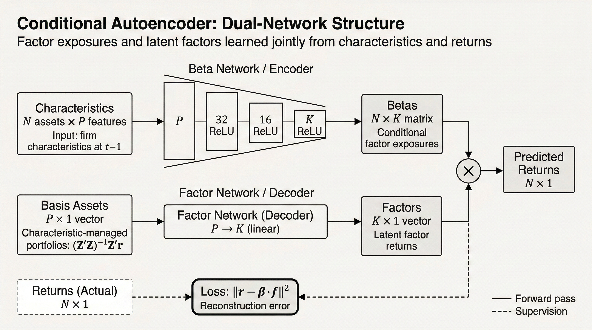

# Latent-Factor Models

This guide covers the structural latent-factor family:

- `PCAModel`
- `RPPCAModel`
- `IPCAModel`
- `CAEModel`

These models all estimate latent structure, but they do not all use the same data contract
or economic assumptions.

The family splits into two groups:

- persistent-panel estimators: `PCAModel`, `RPPCAModel`
- dated cross-sectional estimators: `IPCAModel`, `CAEModel`

## Overview

| Model | Contract | Loading structure | Predictive object |
|---|---|---|---|
| `PCAModel` | `PersistentPanelBatch` | static loadings | `beta × premium` after a forecaster |
| `RPPCAModel` | `PersistentPanelBatch` | static loadings with risk-premium-aware extraction | `beta × premium` after a forecaster |
| `IPCAModel` | `CrossSectionBatch` | linear characteristic-implied betas | `beta × premium` after a forecaster |
| `CAEModel` | `CrossSectionBatch` | nonlinear characteristic-implied betas | `beta × premium` after a forecaster |

## PCA

`PCAModel` is the persistent-panel baseline.

Use it when:

- entity identity is stable through time
- variance decomposition is the primary structural task
- a simple low-dimensional baseline is more important than pricing-aware extraction

It estimates:

- static loadings
- factor returns from demeaned panel returns



It does not directly forecast expected returns. That requires:

1. a factor-premium forecast
2. an asset mapper

## RP-PCA

`RPPCAModel` extends PCA by letting expected-return information influence factor extraction.

Conceptually, it moves from:

- explaining covariance only

to:

- explaining covariance and cross-sectional mean differences

This makes it attractive when you want factors that matter for pricing rather than only for
variance decomposition.

The model follows
[Lettau and Pelger (2020)](../reference/academic-references.md#ref-lettau-pelger-2020):
the extraction criterion blends covariance structure with pricing information instead of
treating those as separate downstream concerns.

Key config fields:

- `gamma`
- `base_moment`
- `scale_by_asset_volatility`
- `normalize_loadings`
- `orthogonalize_factors`

## IPCA

`IPCAModel` is the linear bridge between PCA and neural conditional factor models.

Economic idea:

- asset loadings are not static
- they are linear functions of observable characteristics

In the library, `IPCAModel`:

- consumes `CrossSectionBatch`
- alternates between factor estimation and gamma estimation
- returns a `LatentFactorState` with conditional betas and factor history

The economic interpretation follows
[Kelly, Pruitt, and Su (2019)](../reference/academic-references.md#ref-kelly-pruitt-su-2019):
characteristics do not predict returns directly in an unconstrained way. They parameterize
conditional factor exposures.

Predictive use:

- forecast factor premia from historical factor returns
- map current conditional betas times those premia back to assets

## CAE

`CAEModel` is a conditional autoencoder structural extractor.

It should be interpreted as:

- a nonlinear extension of IPCA
- not as a direct supervised return predictor

The model learns:

- a nonlinear mapping from characteristics to betas
- latent factor returns from managed portfolios



The implementable return forecast is still a two-step object:

```text
current nonlinear betas × ex ante factor-premium forecast
```

Current implementation features:

- configurable hidden units
- checkpoint-aware training
- optional ensemble averaging across saved checkpoints
- classification mode that still keeps factor construction tied to continuous returns

This is the right way to think about the model:

- `CAEModel` is a nonlinear extension of IPCA
- the fitted return uses realized latent factor returns
- the tradeable forecast replaces those realized factor returns with an ex ante premium
  estimate

That is exactly why `CAEModel` lives naturally inside
`LatentFactorForecastPipeline` rather than exposing a monolithic end-to-end return-prediction
API.

## Persistent Vs Ragged

The split between panel and cross-sectional models is intentional.

### Persistent-panel family

- `PCAModel`
- `RPPCAModel`

### Ragged cross-sectional family

- `IPCAModel`
- `CAEModel`

This is not an implementation detail. It reflects the actual assumptions the models need.

If entity identity is unstable, use `IPCAModel` or `CAEModel`, not `PCAModel` or
`RPPCAModel`.

## Recommended Defaults

### Simple baseline

- `PCAModel` or `IPCAModel`
- `ExpandingMeanFactorForecaster`
- `BetaLambdaMapper`

### Pricing-aware linear baseline

- `RPPCAModel`
- `ExpandingMeanFactorForecaster`
- `BetaLambdaMapper`

### Nonlinear latent-factor baseline

- `CAEModel`
- `ExpandingMeanFactorForecaster`
- `BetaLambdaMapper`

### Better-than-mean factor forecasting

Swap in:

- `AR1FactorForecaster`
- `EWMABaseFactorForecaster`

without changing the structural model.
