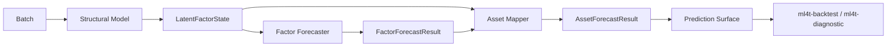

# Latent-Factor Pipelines

The core latent-factor abstraction in `ml4t-models` is:

```text
structural model -> latent factor state -> factor forecaster -> asset mapper
```

This keeps three distinct economic objects separate:

1. exposures and factor realizations
2. ex ante factor-premium forecasts
3. asset-level expected returns

## Why The Split Matters

For models like `IPCA` and `CAE`, the in-sample fitted return typically uses realized factor returns. That is useful for reconstruction and attribution, but not directly for trading.

The implementable forecast replaces realized factor returns with a forecast or estimate of factor premia.

## Pipeline Class

`LatentFactorForecastPipeline` composes the three stages:

```python
from ml4t.models import (
    BetaLambdaMapper,
    ExpandingMeanFactorForecaster,
    IPCAConfig,
    IPCAModel,
    LatentFactorForecastPipeline,
)

pipeline = LatentFactorForecastPipeline(
    model=IPCAModel(IPCAConfig(n_factors=3)),
    forecaster=ExpandingMeanFactorForecaster(),
    mapper=BetaLambdaMapper(),
)
```

## Objects At Each Stage

### Structural Model

Implements:

- `fit(batch) -> FitSummary`
- `extract(batch, checkpoint=None) -> LatentFactorState`

The extracted state contains:

- `asset_betas`
- optional `factor_returns`
- timestamps and asset IDs
- metadata such as selected checkpoint

### Factor Forecaster

Implements:

- `fit(state) -> FitSummary`
- `predict(state) -> FactorForecastResult`

Current forecasters:

- `ExpandingMeanFactorForecaster`
- `AR1FactorForecaster`
- `EWMABaseFactorForecaster`

### Asset Mapper

Implements:

- `predict(state, factor_forecast) -> AssetForecastResult`

Current mapper:

- `BetaLambdaMapper`

## The Default Predictive Baseline

The simplest predictive latent-factor workflow is:

```text
fit structural model on training data
estimate historical factor returns
forecast factor premia by the training-sample mean
map betas × premia back to assets
```

This is the baseline represented by:

- `ExpandingMeanFactorForecaster`
- `BetaLambdaMapper`

## Checkpoints

Neural structural models such as `CAEModel` expose configurable checkpoints:

- `checkpoint_interval`
- `checkpoint_epochs`
- `default_checkpoint`

This lets you:

- extract structural states at multiple training horizons
- fit and evaluate downstream factor forecasters at those checkpoints
- choose reporting checkpoints explicitly rather than hard-coding “best epoch” behavior

## Diagram



## When Not To Use This Pipeline

Do not force:

- `StochasticDiscountFactorModel`
- portfolio learners
- direct signal predictors

through this latent-factor composition. Those families solve different problems and have different native outputs.

