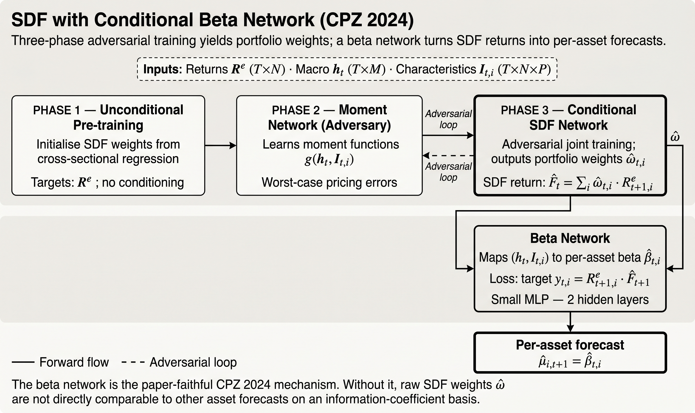

# Stochastic Discount Factor

`StochasticDiscountFactorModel` is a separate model family because the native object is not
a latent factor with a premium forecast. The native object is a weight-based pricing-kernel
proxy.

The implementation follows the phase-aware adversarial design of
[Chen, Pelger, and Zhu (2021)](../reference/academic-references.md#ref-chen-pelger-zhu-2021):
learn a pricing kernel that is disciplined by the most informative test-asset moments rather
than only by reconstruction or covariance fit.

## What The Model Estimates

The model is built around a no-arbitrage objective and returns:

- `asset_weights`
- optional realized `sdf_values`
- checkpoint-aware phase history

The public extracted state is:

- `StochasticDiscountFactorState`

| Input contract | Native output | Primary use | Secondary mapping |
|---|---|---|---|
| `CrossSectionBatch` | `StochasticDiscountFactorState` | SDF weights and pricing-kernel series | optional expected-return projection |

`returns` are required for fitting. `characteristics` describe the cross-section used by the
weight network, and `context_features` can provide date-level state such as macro or market
features.

## Why It Is Separate From Latent Factors

Latent-factor models estimate:

- exposures
- factor realizations
- then expected returns through `beta × premium`

The stochastic discount factor family instead estimates a traded pricing object directly. It
is closer to:

- a weight-learning model
- a no-arbitrage estimator
- a direct portfolio construction mechanism

That is why it lives under:

- `ml4t.models.stochastic_discount_factor`

instead of under `latent_factors`.

## Training Phases

The model is phase-aware:

1. unconditional SDF training
2. moment network fitting
3. conditional SDF refinement

Key config fields:

- `n_epochs_unc`
- `n_epochs_moment`
- `n_epochs_cond`
- `checkpoint_epochs`
- `default_checkpoint`

For the beta-head side:

- `beta_n_epochs`
- `beta_checkpoint_epochs`
- `beta_default_checkpoint`



## Native Output

The native output mode is:

- `weights`

That is enforced by the current model implementation. If you want expected-return-style
projections, use an explicit downstream mapper rather than treating expected returns as the
primary estimation target.

## Optional Return Mapping

Current helpers include:

- `LinearStochasticDiscountFactorReturnMapper`
- `StochasticDiscountFactorBetaNetworkHead`

These are downstream transformations. They do not change the fact that the core estimator is
weight-native.

The linear mapper is a transparent baseline. The beta-network head is the flexible option
when a nonlinear relation between SDF weights, characteristics, and return projections is
useful for comparison or downstream ranking.

The beta-network head is useful when you need an expected-return-like object for comparison
with latent-factor studies, ranking experiments, or downstream backtests that expect asset
predictions. It should still be documented as a secondary mapping, not as the primary SDF
target.

## Typical Workflow

```python
from ml4t.models import CrossSectionBatch, StochasticDiscountFactorConfig, StochasticDiscountFactorModel

model = StochasticDiscountFactorModel(
    StochasticDiscountFactorConfig(
        checkpoint_epochs=(256, 512, 768, 1024, 1280),
        default_checkpoint=1280,
    )
)

fit_summary = model.fit(batch)
state = model.extract(batch)
```

## Practical Interpretation

There are two common uses:

### 1. Trade The Weight Output Directly

Use the extracted asset weights as a cross-sectional allocation signal, subject to:

- leverage normalization
- caps
- liquidity filters
- turnover controls

### 2. Use A Beta-Or Return-Projection Head

If you need asset-level expected-return-like quantities for a downstream ranking or
comparison study, use an explicit projection helper and document that it is a secondary
object.

## Checkpoints

Because the structural horizon is long, this family should usually use:

- explicit sparse `checkpoint_epochs`

rather than dense interval checkpointing.

That keeps:

- extraction cost manageable
- beta-head retraining manageable
- model provenance easier to interpret

For that reason, the recommended default is sparse explicit `checkpoint_epochs`, not dense
interval checkpointing.
